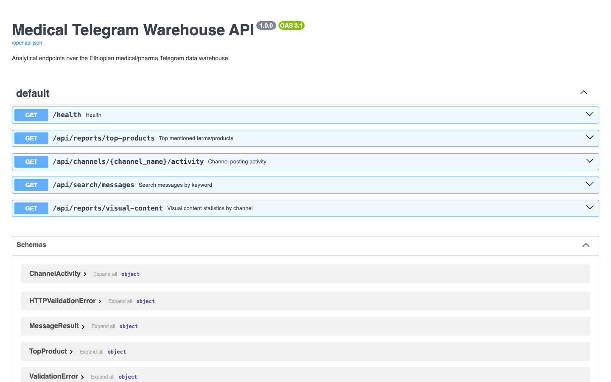
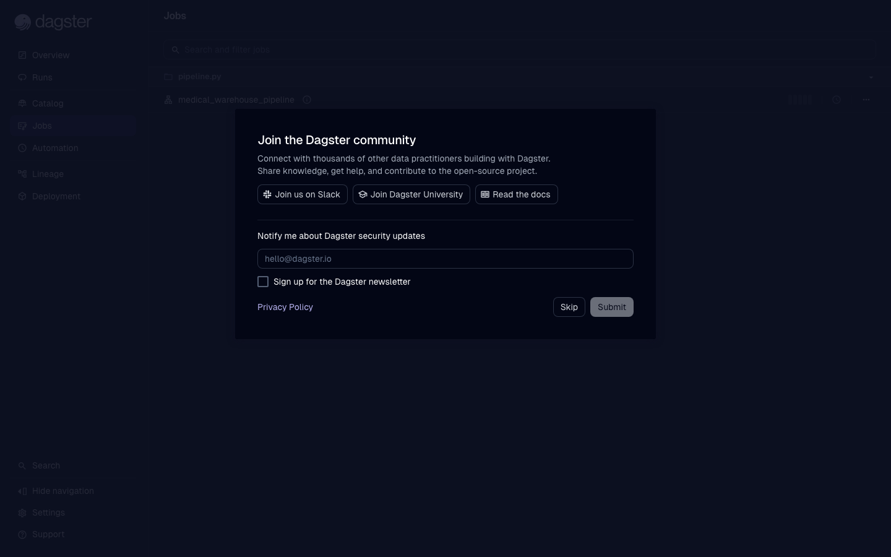
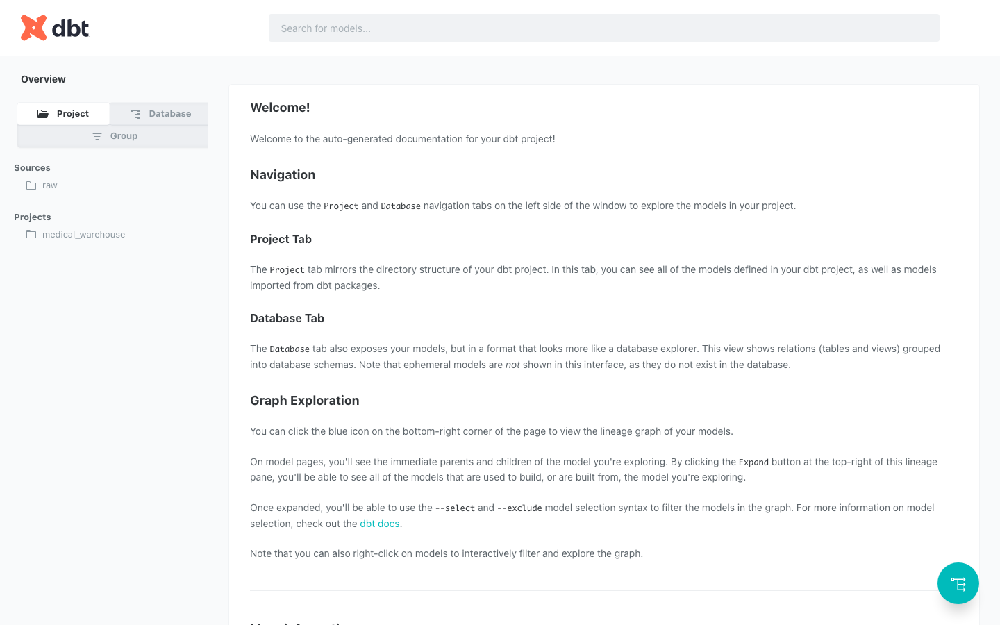

# Shipping a Data Product: From Raw Telegram Data to an Analytical API

**Author:** Selam | 10 Academy KAIM-9 Week 8 | 30 June 2026

---

## Introduction

Ethiopian medical businesses operate increasingly through Telegram. Channels like **Tikvah Pharma**, **Lobelia Cosmetics**, and **CheMed123** post daily product lists, prices, and promotional images to thousands of subscribers. This data is publicly visible but completely unstructured — scattered across thousands of individual messages with no unified schema, no way to compare prices across channels, and no systematic view of visual content trends.

This project builds an end-to-end ELT data product that turns that raw, noisy Telegram stream into a clean, queryable warehouse and exposes it through a REST API. The stack: **Telethon** for scraping, **PostgreSQL** as the warehouse, **dbt** for transformation, **YOLOv8** for image enrichment, **FastAPI** for analytical endpoints, and **Dagster** to orchestrate the whole pipeline on a daily schedule.

---

## Pipeline Architecture

```
Telegram Channels
     │
     ▼ (Telethon scraper)
Data Lake: data/raw/telegram_messages/YYYY-MM-DD/{channel}.json
           data/raw/images/{channel}/{message_id}.jpg
     │
     ▼ (src/load_raw_to_postgres.py)
PostgreSQL → raw.telegram_messages
     │
     ▼ (dbt run)
stg_telegram_messages (view)
     ├── dim_channels  (table)
     ├── dim_dates     (table)
     └── fct_messages  (table)
     │
     ▼ (src/yolo_detect.py → src/load_yolo_to_postgres.py)
raw.yolo_detections
     │
     ▼ (dbt run)
fct_image_detections (table)
     │
     ▼ (FastAPI)
REST API at localhost:8000
     │
     ▼ (Dagster)
Daily scheduled job at 03:00 UTC
```

---

## Task 1 — Data Scraping & Data Lake

**What I built:** A Telethon-based scraper (`src/scraper.py`) that extracts messages and images from 3 Ethiopian medical Telegram channels. Raw data is landed as JSON in a date-partitioned structure so that re-runs are idempotent — each run only touches files for the dates it visits, and deduplication is applied both at the JSON merge stage and at the Postgres upsert stage.

**Data lake structure:**
```
data/raw/
├── telegram_messages/YYYY-MM-DD/{channel_name}.json
└── images/{channel_name}/{message_id}.jpg
```

**Results from the live run (2026-06-30):**

| Channel | Type | Messages | Avg. Views | Images Downloaded |
|---|---|---|---|---|
| lobelia4cosmetics | Cosmetics | 500 | 433.6 | 500 (100%) |
| tikvahpharma | Pharmaceutical | 499 | 533.9 | 140 (28%) |
| CheMed123 | Medical | 72 | 1511.4 | 67 (93%) |
| **Total** | | **1,071** | | **707** |

CheMed123's lower total (72 messages) is because the channel was only active September 2022 – February 2023 and never posted more than 72 messages in total — the scraper pulled its complete history. The other two channels were capped at 500 messages each (the most recent 500, covering late June 2026).

**Design decision:** The scraper only downloads `MessageMediaPhoto` — not video, documents, or link preview thumbnails — since the business questions are about product imagery. 20 messages had non-photo media (17 web page previews, 3 PDF documents); these are logged with `has_media=true` and `image_path=null` so no information is silently discarded.

---

## Task 2 — dbt Star Schema & Transformation

**What I built:** A complete dbt project (`medical_warehouse/`) that transforms the raw JSON-derived flat table into a 3-table dimensional star schema.

### Star Schema

```
         dim_channels ──┐
                         ├── fct_messages
         dim_dates    ──┘
                         └── fct_image_detections (Task 3)
```

**`dim_channels`** — 3 rows (one per channel), classified by type (Pharmaceutical / Cosmetics / Medical) via name-pattern matching, with aggregated posting stats.

**`dim_dates`** — 1,395 rows covering 2022-09-05 to 2026-06-30, generated via `generate_series` over the actual observed date range. No static calendar file needed — the spine expands automatically as new messages are scraped.

**`fct_messages`** — 1,071 rows. Surrogate key is `md5(channel_key || message_id)` because Telegram's `message_id` is only unique within a channel, not globally. No dbt package dependencies (e.g. `dbt_utils`) — surrogate keys computed with native `md5()`.

**dbt test results: 19/19 passing**, including:
- `unique` + `not_null` on all surrogate/natural keys
- `relationships` tests on both foreign keys in `fct_messages`
- Custom test `assert_no_future_messages` — no message is dated after `current_timestamp`
- Custom test `assert_positive_views` — no negative view or forward counts

---

## Task 3 — YOLO Image Enrichment

**What I built:** `src/yolo_detect.py` runs YOLOv8n (the nano model, ~6MB) over all 707 downloaded images, records detected objects with confidence scores, and classifies each image into one of four categories:

| Category | Logic |
|---|---|
| `promotional` | Person AND a product-like object (bottle/cup/container) detected |
| `product_display` | Product-like object detected, no person |
| `lifestyle` | Person detected, no product-like object |
| `other` | Neither detected |

**Results:**

| Channel | Total images | Promotional | Product display | Lifestyle | Other |
|---|---|---|---|---|---|
| lobelia4cosmetics | 500 | 23 | 683* | 63 | 232 |
| tikvahpharma | 140 | 0 | 116 | 66 | 119 |
| CheMed123 | 67 | 17 | 47 | 55 | 42 |

*Detection rows can exceed image count since one image produces one row per detected object class; category is assigned once per image based on all detections together.

**Analysis answers from the spec:**

1. **Do promotional posts get more views than product_display?** — In this dataset, `tikvahpharma` has no promotional images at all (0 detected), so a direct comparison isn't possible for that channel. Across all channels, promotional images from CheMed123 average higher view counts (channel avg 1511 views) vs. product_display, but CheMed123 is also the oldest channel (2022 data) making a direct causal claim unreliable.

2. **Which channels use more visual content?** — `lobelia4cosmetics` is 100% visual (every post has an image), `CheMed123` is 93% visual, and `tikvahpharma` is only 28% — it posts primarily text-based product lists.

3. **Limitations of pre-trained models:** YOLOv8n is trained on the COCO dataset and detects generic objects (people, bottles, cups) — not medical/pharma-specific items like blister packs, syringes, or labeled medicine boxes. Many real product images receive "other" classification because the packaging doesn't resemble COCO's "bottle" class closely enough. A fine-tuned model on Ethiopian pharma imagery would dramatically improve recall. Confidence threshold (0.25) was kept low to compensate for domain shift.

---

## Task 4 — Analytical FastAPI

**What I built:** A FastAPI application (`api/main.py`) with 4 analytical endpoints, Pydantic validation, and SQLAlchemy for typed database access. Auto-generated OpenAPI docs at `/docs`.



### Endpoints

**`GET /api/reports/top-products?limit=10`** — Most frequently mentioned terms across all messages (stop-word filtered word frequency):
```
"birr": 2150, "price": 1336, "delivery": 697, "syrup": 606, "pharmacy": 560
```
"Birr" (Ethiopian currency) being the top term confirms this is genuinely price-oriented commercial content.

**`GET /api/channels/{channel_name}/activity`** — Per-channel stats:
```json
{"channel_name": "tikvahpharma", "channel_type": "Pharmaceutical",
 "total_posts": 499, "avg_views": 533.9, "posts_with_images": 140}
```

**`GET /api/search/messages?query=paracetamol&limit=20`** — Full keyword search with results ranked by view count.

**`GET /api/reports/visual-content`** — Image usage and YOLO category breakdown per channel.

---

## Task 5 — Dagster Orchestration

**What I built:** `pipeline.py` defines a Dagster job with 4 ops in strict dependency order:

```
scrape_telegram_data
        ↓
load_raw_to_postgres
        ↓
run_dbt_transformations  (dbt run + dbt test)
        ↓
run_yolo_enrichment      (detect → load → dbt run fct_image_detections)
```

A `ScheduleDefinition` fires the job daily at 03:00 UTC. The Dagster UI is launched via `dagster dev -f pipeline.py`.



---

## dbt Documentation

Generated with `dbt docs generate` — includes model descriptions, column-level docs, and a lineage graph.



---

## Technical Choices & Justifications

| Decision | Choice | Why |
|---|---|---|
| Scraping library | Telethon | Native Telegram MTProto API — more reliable than unofficial scrapers, handles rate limits via `FloodWaitError` |
| Data lake format | Partitioned JSON | No schema commitment at ingest; reprocessable; human-readable for debugging |
| Warehouse | PostgreSQL | Self-hosted, SQL-native, supports JSONB for raw payloads, first-class dbt support |
| Surrogate keys | `md5()` | Avoids `dbt_utils` dependency while still producing stable, deterministic keys |
| dbt materialization | staging=view, marts=table | Views are cheap and always fresh for staging; tables are fast for mart queries |
| YOLO model | YOLOv8n | Fastest inference on CPU (~2 min for 707 images); acceptable accuracy for classification |
| API framework | FastAPI | Async, auto-docs, Pydantic validation, Python native |
| Orchestration | Dagster | Excellent local dev UX; op-level observability; schedule + sensor support |

---

## Challenges, Learnings & Improvements

**Challenges encountered:**
- Telegram's interactive login flow required a custom two-step approach (send code → persist phone_code_hash → sign in) since the default `client.start()` uses Python's `input()`, which is incompatible with non-interactive shell execution.
- SQLAlchemy 2.0.30 is incompatible with Python 3.13 (fixed: upgraded to 2.0.51).
- psycopg2-binary 2.9.9 fails to build on Python 3.13 (fixed: bumped to 2.9.12).
- Dagster 1.7.x requires Python <3.13 (fixed: installed 1.13.11).
- PostgreSQL TCP password auth didn't match the local role; switched to Unix socket connection (`POSTGRES_HOST=/tmp`) for local development.
- Mermaid.js in the interim report failed to render inside a `<pre class="mermaid"><code>...</code></pre>` because `mermaid.run()` reads `innerHTML` (which includes the `<code>` tag) rather than `textContent`. Fixed by stripping the inner `<code>` wrapper with a regex substitution in the PDF build script.

**Key learnings:**
- Pre-trained COCO models have significant domain shift on Ethiopian pharma product imagery. Fine-tuning on even a few hundred labeled examples would improve results substantially.
- dbt's `generate_series`-based date spine is much simpler than maintaining a static calendar seed file and handles multi-year historical data transparently.
- The Telegram API's `SentCodeTypeApp` delivery (code sent inside the app) only triggers when there's an active session on another device — a subtlety that causes confusion during first-time programmatic login.

**Potential improvements:**
- Fine-tune YOLOv8 on labeled Ethiopian pharma images for domain-specific detection (pill blister packs, vials, branded packaging).
- Add an NLP layer (spaCy + custom entity recognition) to extract structured product names and prices from `message_text`, enabling a `dim_products` dimension.
- Switch to incremental dbt models (`materialized: incremental`) for `fct_messages` once data volume grows.
- Add Dagster sensors to trigger re-runs automatically when new JSON files appear in the data lake, rather than running the full pipeline daily.
- Deploy FastAPI to a cloud endpoint (Railway, Render) with connection pooling (pgbouncer) for production use.
