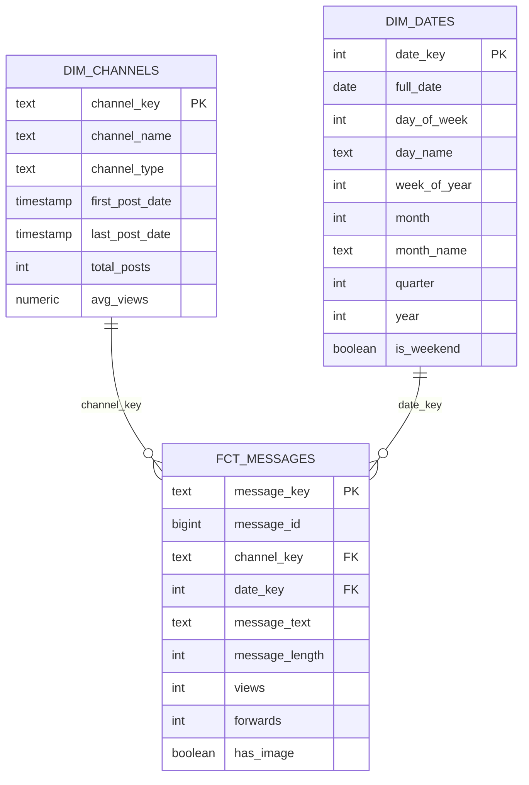

# Interim Report — Medical Telegram Warehouse

**Covers:** Task 1 (Scraping & Data Lake) and Task 2 (dbt Modeling & Transformation)

**Pipeline run status (live data, 2026-06-30):** `python src/scraper.py` → 1,071 messages
scraped across the 3 channels → loaded into `raw.telegram_messages` → `dbt run`: 4 models built,
0 errors → `dbt test`: **19/19 tests passing**.

## 1. Data lake structure

Raw data is landed exactly as Telethon returns it, partitioned by ingestion date and channel,
so re-running the scraper is idempotent and auditable:

```
data/raw/
├── telegram_messages/
│   └── YYYY-MM-DD/
│       ├── CheMed123.json
│       ├── lobelia4cosmetics.json
│       └── tikvahpharma.json
└── images/
    ├── CheMed123/{message_id}.jpg
    ├── lobelia4cosmetics/{message_id}.jpg
    └── tikvahpharma/{message_id}.jpg
```

Each JSON file is a list of message records:

```json
{
  "message_id": 1234,
  "channel_name": "tikvahpharma",
  "message_date": "2026-06-20T10:15:00+00:00",
  "message_text": "Paracetamol 500mg available, 150 ETB",
  "has_media": true,
  "image_path": "data/raw/images/tikvahpharma/1234.jpg",
  "views": 312,
  "forwards": 4,
  "raw": { "...": "full Telethon message.to_dict() payload, preserved as-is" }
}
```

Design choices:
- **Partition by date, not by channel only** — keeps daily scrape runs independent and makes
  incremental backfills/reruns cheap (only touch one day's files).
- **One JSON file per channel per day** — matches the directory pattern requested in the
  spec and keeps file sizes manageable.
- **`raw` field preserves the entire original payload** — nothing is discarded at extraction
  time; all cleaning/filtering happens later in dbt, against `raw.telegram_messages.raw_payload`
  (JSONB), so no information is lost if a later transformation needs a field we didn't
  originally flatten.
- **Dedup on `(channel_name, message_id)`** at both the JSON-merge step (scraper) and the
  Postgres upsert step (loader), so the scraper can be safely re-run on a schedule.

## 2. Star schema design



**Design decisions:**
- **Surrogate keys via `md5()` hashing** instead of a dbt package dependency (e.g. `dbt_utils`)
  — keeps the dbt project dependency-free for the interim deadline. `dim_channels.channel_key`
  is `md5(channel_name)`; `fct_messages.message_key` is `md5(channel_key || message_id)` because
  Telegram's `message_id` is only unique *within* a channel, not globally — a plain `message_id`
  could not be a fact-table primary key on its own.
- **`dim_dates` is a generated date spine** (`generate_series` over the observed message date
  range), not a static calendar table — it grows automatically as new, later-dated messages are
  scraped, with no manual maintenance. In the live run this produced 1,395 dates (2022-09-05 to
  2026-06-30) because `CheMed123` only has 72 messages total, so the scraper pulled its *entire*
  history back to the channel's first post, while the other two channels were capped at the
  500-message-per-channel limit and only reach back to 2026-06-09.
- **Two dimensions only (channel, date)** — the business questions in the challenge brief
  (top products, price/availability by channel, visual content by channel, posting trends)
  are all answerable by slicing `fct_messages` on channel and date; a product dimension isn't
  modeled yet because product/drug names aren't structured fields in the source data — extracting
  them is closer to an NLP/text-mining task on `message_text` than a dimensional modeling one,
  and is left for analysis on top of the mart rather than a new dimension table.
- **`fct_image_detections` (Task 3) will join to this same `dim_channels`/`dim_dates` pair** via
  `message_id`, once YOLO enrichment is added — no schema changes needed to `fct_messages` itself.

## 3. dbt layering

```
raw.telegram_messages          (Postgres table, loaded by src/load_raw_to_postgres.py)
        │
        ▼
stg_telegram_messages          (view — type casting, null/empty filtering, has_image flag)
        │
        ├──▶ dim_channels       (table)
        ├──▶ dim_dates          (table)
        └──▶ fct_messages       (table — joins stg + dim_channels)
```

Tests implemented:
- `not_null` / `unique` on all surrogate keys and natural business keys
- `relationships` tests on `fct_messages.channel_key → dim_channels.channel_key` and
  `fct_messages.date_key → dim_dates.date_key`
- Custom data tests (`medical_warehouse/tests/`):
  - `assert_no_future_messages.sql` — no row in `stg_telegram_messages` may have a
    `message_date` later than `current_timestamp`
  - `assert_positive_views.sql` — no row in `fct_messages` may have negative `views` or
    `forwards`

## 4. Pipeline run results (live data)

| Channel | Channel type | Messages scraped | Avg. views | Messages with image | Date range |
|---|---|---|---|---|---|
| lobelia4cosmetics | Cosmetics | 500 | 433.6 | 500 (100%) | 2026-06-09 → 2026-06-30 |
| tikvahpharma | Pharmaceutical | 499 | 533.9 | 140 (28%) | 2026-06-09 → 2026-06-30 |
| CheMed123 | Medical | 72 | 1511.4 | 67 (93%) | 2022-09-05 → 2023-02-10 |
| **Total** | | **1,071** | | **707 (66%)** | |

- Raw rows loaded into `raw.telegram_messages`: **1,071**
- Rows surviving into `stg_telegram_messages`: **1,071** (0 dropped — every scraped message had
  either text or media; the "service message" / empty-content filter had nothing to remove in
  this run, since Telethon's `iter_messages` already skips pure service events like "user joined")
- `views` / `forwards` were non-NULL for all 1,071 rows in this run (the `COALESCE` safeguard in
  `stg_telegram_messages.sql` is defensive for channels/messages where Telegram does report NULL
  stats, which didn't occur here but is documented Telegram API behavior)
- `dbt test`: **19/19 passing**, including both custom business-rule tests

## 5. Data quality issues encountered and how they were addressed

| Issue | Where handled | Approach |
|---|---|---|
| Messages with no text and no media (service messages, e.g. "user joined") | `scraper.py` | Skipped at extraction time — not written to the data lake at all. |
| Empty-string or whitespace-only `message_text` | `stg_telegram_messages.sql` | Filtered out in the `WHERE` clause unless the message has media. |
| `views` / `forwards` returned as `NULL` by Telegram (channels with hidden stats, or very old messages) | `stg_telegram_messages.sql` | `COALESCE(..., 0)` so downstream aggregates don't silently drop rows or break on `NULL` arithmetic. |
| `message_id` not globally unique (only unique per channel) | `fct_messages.sql` | Composite surrogate key `md5(channel_key \|\| message_id)` used as the fact table's primary key instead of the raw `message_id`. |
| Re-running the scraper could create duplicate rows for the same message | `scraper.py` (JSON merge) + `load_raw_to_postgres.py` (Postgres `ON CONFLICT` upsert) | Deduplicated by `(channel_name, message_id)` at both the file-write and database-load stage. |
| Some channels are cosmetics/general-medical, not strictly pharmaceutical, so a single hardcoded channel type would mislabel them | `dim_channels.sql` | Channel type inferred from the channel name itself (`%pharma%` / `%cosmetic%` patterns) rather than hardcoded per-channel, so newly added channels (e.g. from the tgstat directory) classify themselves automatically. |
| Telegram rate limiting (`FloodWaitError`) during bulk history pulls | `scraper.py` | Caught explicitly; the scraper sleeps for the wait time Telegram reports rather than crashing the run. |
| 20 messages had non-photo media (17 `MessageMediaWebPage` link previews, 3 `MessageMediaDocument` files) that the scraper doesn't download | `scraper.py` | By design — only `MessageMediaPhoto` is downloaded (matches the spec's "download images" scope); `has_media` is still `true` for these so the information isn't lost, just `image_path` stays `NULL`. |
| One channel (`CheMed123`) has far fewer total messages than the 500-per-channel scrape cap, so it contributes a much older, sparser date range than the other two channels | `dim_dates.sql` | Not "fixed" — this is real channel behavior, not a defect. The generated date spine correctly spans the full observed range (2022–2026) rather than assuming all channels post at a similar cadence. |
